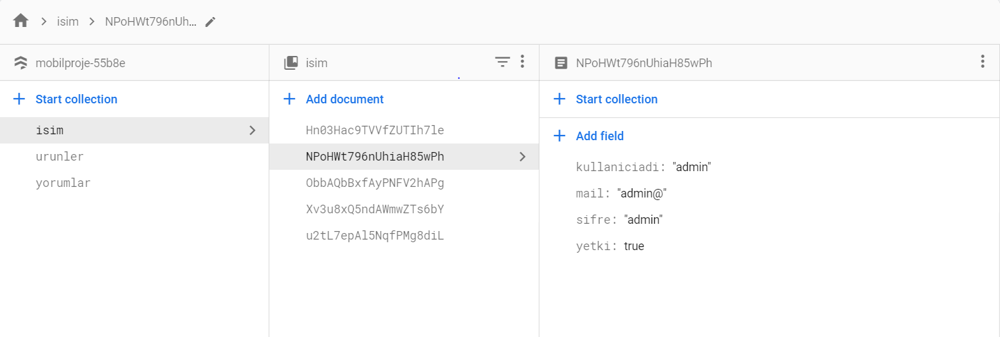
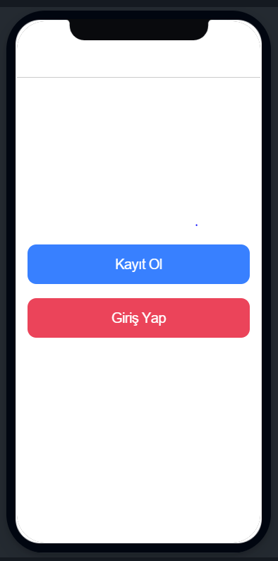
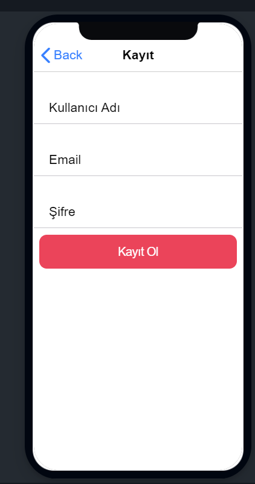
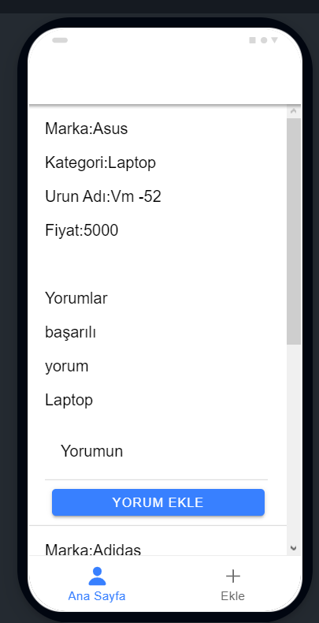
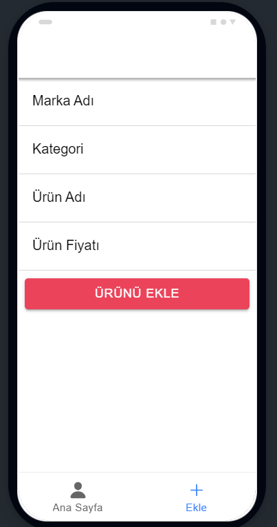
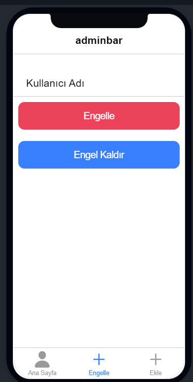
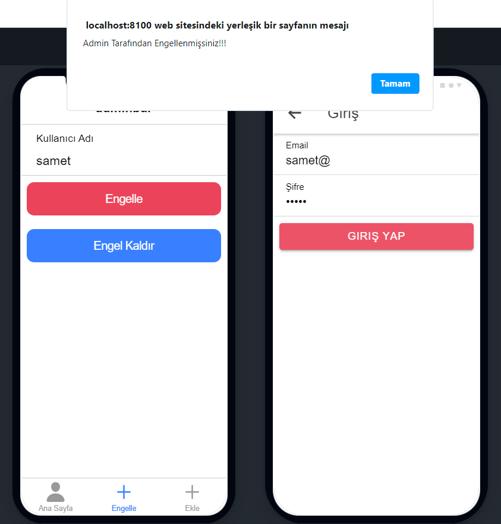

npm install
npm audit fix
ionic serve

Uygulamanın amacı kullanıcıların ürünler hakkında yorum yapmasıdır.
Veritabanı olarak firebase firestore kullandım.

Uygulama açıldığında ilk olarak home açılır.
Burada kayıt olma ile girişyap butonu vardır.

Kullanıcı kayıt ola basarsa registrationa yönlendirilir.
Burada bilgiler doldurularak kayıt olma tuşuna basılır.
Tuşa basma sonucu veri tabanında aynı mailden veri tabanında olup olmadığı kontrol edilir.Yoksa kayıt tamamlanır.

Kullanıcı giriş yap butonuna basarsa logine yönlendirilir.
  Gerekli bilgiler giriliğ giriş yap butonuna basılınca böyle bir 
  kullanıcı olup olmadığı kontrol edilir.Varsa admin olup olmadığı kontrol
  edilir.Buna göre yönlendirme yapılır.
  
  

  Kişi kullanıcı ise yönlendirilen sayfanın navigasyon barında anasayfa ve ekle
  yönlendirmeleri bulunur.Ekle de ürünler eklenilir.Ürün eklenilirken kontrol edilir
  aynı ürünün daha önceden eklenip eklenmediğine dair.Eklenmişse tekrar eklenmez.
  Ana sayfada ürünler tüm bilgileri ile getirilir.Bilgileri altında herbirene ait
  yeni yorum eklemek için bir text ve buton bulundurulur.
  

  Admin maili="admin@"
  Admin şifresi="admin"
  Kişi admin ise yönlendirilen sayfanın navigasyon barında engelle seçeneğide  bulunur.
  Engelle kısmında engellenecek kişinin kullanıcı adı girilir.Admin engeli kaldırana kadar
  bu kullanıcı uygulamaya giremez.
  
  
